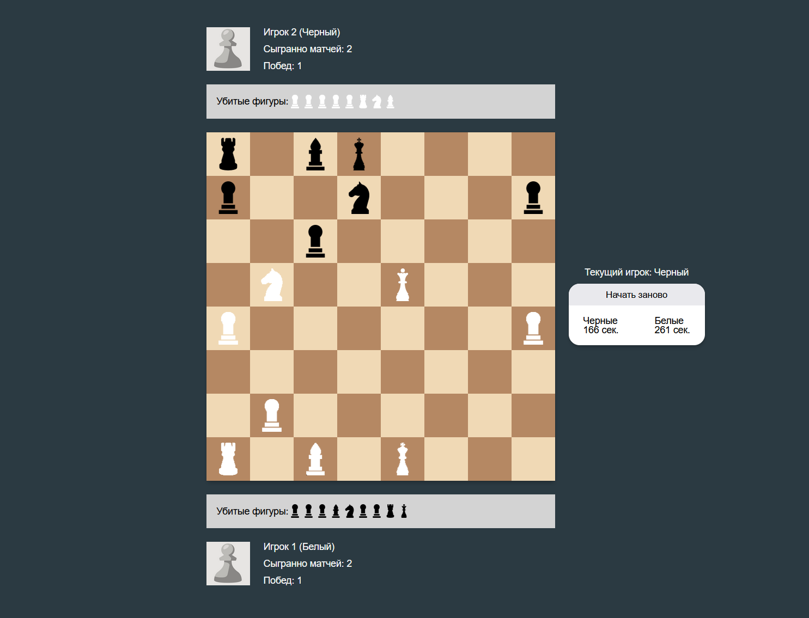

# Edu project chess

Legendary logic game created with TypeScript.
Project made for traning skills and private interes.

<div>
  You can view on this link - https://chess-peach.vercel.app/
</div>

<br />



## Tech

- React/TypeScript
- Webpack
- OOP
- sass modules

## Commands:

### installation:

```
    $ npm i
```

### launch:

```
    $ npm start
```

### Tasks

1. redux
2. jest
3. add login and profile pages
4. eslint
